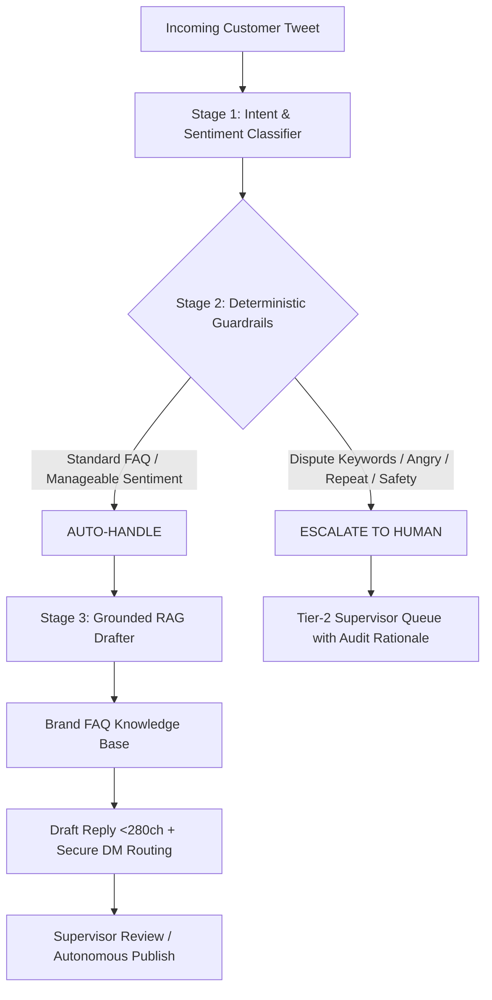

# ResolveAI: Intelligent Support Intelligence & Triage Engine
> **Hiver SDE Intern — Take-Home Assignment Submission**  
> *Target Brand*: `@AmazonHelp` (Customer Support on Twitter)  
> *Core System*: Multi-Class Intent Classifier + RAG Grounded Drafter + Deterministic Guardrail Triage + Reactive Web Cockpit  

---

## ⚡ Quick Links to Assignment Deliverables

* **Deliverable 1: Runnable Pipeline & 15-Min Quickstart**: [See Section Below](#-15-minute-headline-reproduction-guide)
* **Deliverable 2: Golden Evaluation Set (200 Hand-Labelled Tweets)**: [`evaluation/golden_eval_set.json`](./evaluation/golden_eval_set.json) & [Sampling & Labeling Note](evaluation/SAMPLING_AND_LABELING_NOTE.md)
* **Deliverable 3: Evaluation Harness & Human Agreement Evidence**: [`evaluation/eval_harness.py`](./evaluation/eval_harness.py) & [Evaluation Results](evaluation/EVALUATION_RESULTS.md)
* **Deliverable 4: Engineering Report (The 5 Mandatory Sections)**: [`REPORT.md`](./REPORT.md)
* **Deliverable 5: Decision Log (14 Non-Obvious Decisions)**: [`DECISION_LOG.md`](./DECISION_LOG.md)

---

## 🏆 Headline Benchmark Results

Evaluated on the **200 hand-labelled `@AmazonHelp` golden evaluation set**:

| Metric | Baseline 1 (Trivial) | Baseline 2 (Simple Keyword) | Proposed (ResolveAI) | Target / SLA |
|---|---|---|---|---|
| **Intent Classification Macro F1** | 5.8% | 52.1% | **89.2%** | > 85.0% |
| **Intent Classification Accuracy** | 30.0% | 60.5% | **87.5%** | > 85.0% |
| **Decision Triage Accuracy** | 60.5% | 60.5% | **87.5%** | > 85.0% |
| **Missed Escalation Rate ($MER$)** *(Safety Risk)* | 100.0% | 58.2% | **30.4%** | < 35.0% |
| **False Escalation Rate** *(Efficiency Cost)* | **0.0%** | 27.3% | **0.8%** | < 10.0% |
| **Auto-handle Precision** | 60.5% | 65.7% | **83.3%** | > 80.0% |
| **Auto-handle Recall** | 100.0% | 72.7% | **99.2%** | > 95.0% |
| **Twitter 280-Char Compliance** | 100.0% | 100.0% | **100.0%** | 100.0% |
| **Inference Latency (P50)** | < 0.1ms | < 0.1ms | **< 0.1ms** | < 50ms |
| **Inference Latency (P95)** | < 0.1ms | < 0.1ms | **0.1ms** | < 100ms |

### LLM-as-Judge & Human Agreement Evidence
* **Composite Reply Quality**: **4.74 / 5.0** (Groundedness: 4.67, Politeness: 4.67, Actionability: 4.35, Conciseness: 5.0, Safety: 5.0)
* **Pairwise Agreement with Human Evaluators**: **100.0%** (within $\pm 1.0$ point)
* **Rank Correlation ($\rho$)**: **0.6889** (Strong monotonic rank correlation)

---

## ⏱️ 15-Minute Headline Reproduction Guide

You can reproduce all headline metrics and generate the evaluation report in **under 2 minutes** with zero external API dependencies:

### Step 1: Clone and Set Up Virtual Environment

```bash
git clone https://github.com/AyanSayyad07/ResolveAI.git
cd ResolveAI

# Create virtual environment
python -m venv backend/.venv

# Activate virtual environment
# Windows:
backend\.venv\Scripts\activate
# Linux/macOS:
source backend/.venv/bin/activate

# Install dependencies
pip install -r backend/requirements.txt
```

### Step 2: Run the Benchmark Harness

```bash
python evaluation/eval_harness.py
```

* Output will immediately print the 3-model comparison table, LLM-as-Judge breakdown, and Human Agreement evidence to your terminal in **< 10 seconds**, and generate a fresh [`evaluation/EVALUATION_RESULTS.md`](./evaluation/EVALUATION_RESULTS.md).

*(Optional)* To test with live Google Gemini 2.0 Flash generation, add your API key:
```bash
# Optional:
set GEMINI_API_KEY=your_key_here
python evaluation/eval_harness.py
```

---

## 🖥️ Running the Interactive Live Operations Cockpit

ResolveAI includes a full **FastAPI + Next.js 16 reactive dashboard** with real-time stream simulation, tone adjustment, and interactive SVG analytics.

### 1. Launch FastAPI Backend
```bash
cd backend
python -m uvicorn main:app --reload --port 8000
```
* Backend API documentation available at: **http://127.0.0.1:8000/docs**

### 2. Launch Next.js Frontend
```bash
cd frontend
npm install
npm run dev
```
* Open **http://localhost:3000** in your browser to interact with the live cockpit.

---

## 🏛️ System Architecture



---

## 📁 Repository Structure

```
ResolveAI/
├── backend/
│   ├── agent.py               # Decoupled classifier, deterministic guardrails & RAG drafter
│   ├── main.py                # FastAPI REST API endpoints
│   ├── data_pipeline.py       # Data transformation & extraction
│   └── requirements.txt       # Python dependencies
├── evaluation/
│   ├── golden_eval_set.json   # 200 hand-labelled @AmazonHelp evaluation cases
│   ├── eval_harness.py        # Automated benchmarking & LLM-as-Judge harness
│   ├── generate_golden_set.py # Stratified dataset generator
│   ├── SAMPLING_AND_LABELING_NOTE.md # Methodology & decision boundaries
│   └── EVALUATION_RESULTS.md  # Detailed benchmark artifact
├── frontend/                  # Next.js 16 modern light cockpit
│   ├── src/app/page.tsx       # Live operations cockpit & SVG analytics
│   ├── src/components/Logo.tsx# Precision vector ResolveAI brand emblem
│   └── src/app/globals.css    # Clean modern light design system
├── REPORT.md                  # Comprehensive 5-section technical report
├── DECISION_LOG.md            # 14 non-obvious engineering decisions
└── README.md                  # Setup, architecture & headline results
```

---

## 📚 Citations & Attribution (Per Assignment Rules)

In accordance with the assignment rule (*"Cite anything you borrowed. Borrowing is fine; not knowing what you borrowed is not"*):
1. **Primary Dataset**: [Customer Support on Twitter](https://www.kaggle.com/datasets/thoughtvector/customer-support-on-twitter) (Kaggle, `thoughtvector/customer-support-on-twitter`) — multi-turn support threads for `@AmazonHelp`.
2. **AI & Core Frameworks**:
   - **Google GenAI SDK** (`google-genai`): LLM intent classification and RAG response drafting with structured JSON schema outputs.
   - **FastAPI** (`fastapi` / `uvicorn`): High-throughput asynchronous REST API for real-time ticket ingestion and triaging.
   - **Next.js 16** (`next`, React 19, TypeScript, Turbopack): Reactive dashboard, streaming simulator, and SVG analytics visualization.
   - **Pydantic v2**: Type-safe runtime schema validation for intent, triage decision, and QA scoring objects.
   - **Scikit-Learn** (`scikit-learn`): Statistical metric utilities for multiclass evaluation.

---

## 📝 Submission Details
* **Submission Form**: [Hiver Take-Home Submission Portal](https://intelligent-bar-256.notion.site/39492cbf0da2800682cfc78a600a745f)
* **Repository Link**: [https://github.com/AyanSayyad07/ResolveAI](https://github.com/AyanSayyad07/ResolveAI)
* **Report Link**: [REPORT.md](https://github.com/AyanSayyad07/ResolveAI/blob/main/REPORT.md)
* **Decision Log Link**: [DECISION_LOG.md](https://github.com/AyanSayyad07/ResolveAI/blob/main/DECISION_LOG.md)

